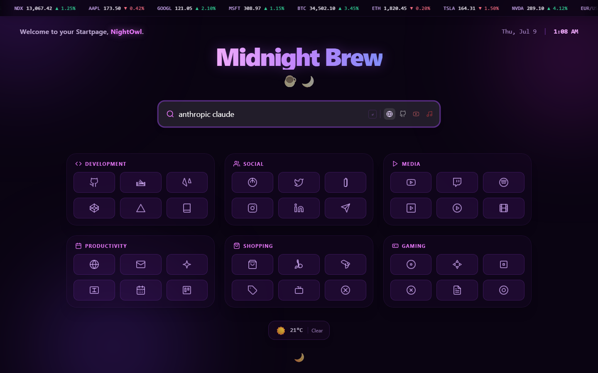
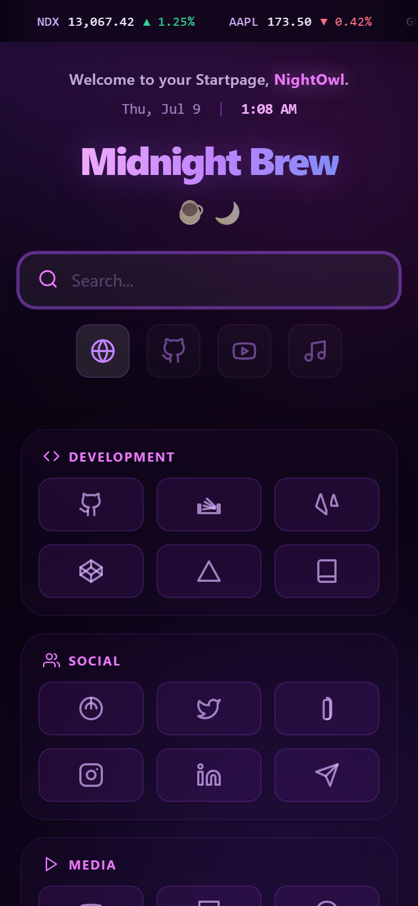

# 🌙 Midnight Brew — Personal Startpage

A single-file, self-hosted browser start page with a dark purple/fuchsia aesthetic: a live clock, geolocated weather, a scrolling market ticker, a multi-platform quick-search bar, and a curated 6-category grid of shortcut links. No build step, no backend, no dependencies to install — just open `index.html`.

<p>
  
  
  
  
  
</p>

## 📸 Preview

<p align="center">
  
</p>

<table>
<tr>
<td width="60%">
  
  <p align="center"><sub>Multi-platform search bar with the glow-on-focus effect</sub></p>
</td>
<td width="40%">
  
  <p align="center"><sub>Fully responsive mobile layout</sub></p>
</td>
</tr>
</table>

## ✨ Features

- 🔍 **Multi-platform search bar** — instantly switch the search target between Web (Startpage), GitHub, YouTube, and YouTube Music, with keyboard-friendly focus and a smooth glow-on-focus effect. Desktop gets inline icon buttons; mobile gets large touch targets below the input.
- 🕒 **Live clock & greeting** — a self-updating header showing the current date and time (`Thu, Jul 9 | 1:08 AM`) alongside a personalized greeting.
- ☁️ **Live weather widget** — uses your browser's geolocation and the free [Open-Meteo](https://open-meteo.com/) API to show current temperature and conditions, no API key required. Falls back gracefully if location is denied or the request fails.
- 📈 **Animated market ticker** — a smooth, seamlessly-looping marquee of stock/crypto tickers across the top of the page that pauses on hover.
- 🗂️ **Six shortcut categories** — Development, Social, Media, Productivity, Shopping, and Gaming, each with 6 curated links, hover glow, and one-click navigation icons.
- 🎨 **Glassy, animated background** — floating blurred "blob" orbs drifting behind a dark, purple-toned Tailwind theme, with glassmorphism cards throughout.
- ✨ **Polished micro-interactions** — fade/slide-in on load, animated exit transition before navigating away, active-state scaling on link taps, and `bfcache`-aware re-entry animations.
- 📱 **Fully responsive** — adaptive layouts for mobile, tablet, and desktop, down to per-breakpoint padding and touch target sizing.
- ⚡ **Zero dependencies to install** — styled entirely with the [Tailwind CDN build](https://tailwindcss.com/docs/installation/play-cdn) and vanilla JavaScript. No `npm install`, no bundler, no framework.

## 🚀 Quick Start (just open it)

Because everything lives in a single `index.html` file with no build tooling, the fastest way to try it is to open it directly:

```bash
git clone https://github.com/niruxx/startpage-gemini.git
cd startpage-gemini
```

Then double-click `index.html`, or open it from your browser with <kbd>Ctrl</kbd>+<kbd>O</kbd> (<kbd>Cmd</kbd>+<kbd>O</kbd> on macOS).

> **Note:** The weather widget calls a remote API and requests browser geolocation, so it needs an active internet connection and (if you want live weather) geolocation permission. Everything else works fully offline.

## 🖥️ Hosting It Locally as Your Browser's New Tab Page

If you want this to load every time you open a new tab, serve it from a local static server instead of `file://` (some browser extensions and geolocation prompts behave more reliably over `http://`).

**Using Python (built into most systems):**

```bash
cd startpage-gemini
python -m http.server 8080
```

Then visit `http://localhost:8080`.

**Using Node.js:**

```bash
npx serve .
```

**Using VS Code:**

Install the [Live Server](https://marketplace.visualstudio.com/items?itemName=ritwickdey.LiveServer) extension, open the folder, and click "Go Live."

### Setting it as your new tab page

- **Chrome / Edge / Brave:** install a "Custom New Tab URL" extension (e.g. *New Tab Redirect*) and point it at your local server URL, or the local file path (`file:///C:/path/to/startpage-gemini/index.html`).
- **Firefox:** go to `about:config`, set `browser.startup.homepage` and `browser.newtab.url` to your local file/server URL.

## 🛠️ Customization

Everything is defined in plain HTML/CSS/JS inside [index.html](index.html), so no build step is required to tweak it:

- **Shortcut links** — edit the `<a href="...">` entries inside each grid section (Development, Social, Media, Productivity, Shopping, Gaming).
- **Search engines** — edit the `handleSearch()` function to change or add search platforms.
- **Colors & theme** — tweak the Tailwind utility classes or the custom `<style>` block at the top of the file (the purple/fuchsia palette, blob animations, marquee speed, etc.).
- **Greeting name** — change `NightOwl` in the header bar to your own name.
- **Ticker symbols** — edit the two duplicated ticker sets in the marquee bar (both need to match for seamless looping).
- **Weather units** — the Open-Meteo request in `initWeather()` can be adjusted for Fahrenheit or additional data points.

## 📁 Project Structure

```
startpage-gemini/
├── index.html         # The entire startpage — markup, styles, and logic
├── assets/img/        # Favicon
├── screenshots/        # README preview images
├── css/, js/           # Legacy/unused boilerplate (not referenced by index.html)
└── LICENSE             # GPLv3
```

## 📄 License

Licensed under the [GNU General Public License v3.0](LICENSE).
